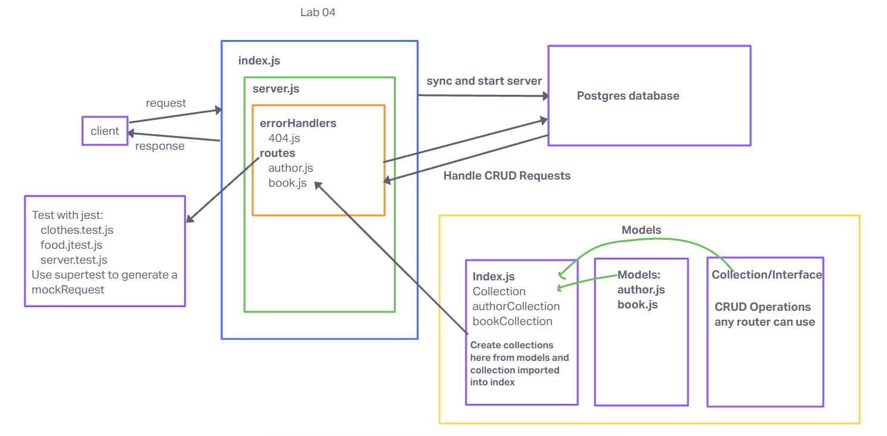

# LAB - Class 02

## Project: Perform CRUD Operations on a database

### Author: Melo

### Problem Domain

Basic API express server where associated databases are created and CRUD operations are tested

### Links and Resources

- [Pull Request](https://github.com/MelodicXP/api-server/pull/6)
- [GitHub Actions ci/cd](https://github.com/MelodicXP/api-server/actions)
- Prod [back-end server url](https://four01lab03-api-server-prod.onrender.com)

### Collaborators

### Setup

#### `.env` requirements (where applicable)

DATABASE_URL: postgres://localhost:XXXX/name-of-server

#### How to initialize/run your application (where applicable)

- e.g. `npm start`

#### How to use your library (where applicable)

#### Features / Routes

- Feature One: Deploy as prod branch once all tests pass.

#### Tests

- How do you run tests?
  - jest and supertest

- Any tests of note?

  - 404 on a bad route
  - 404 on a bad method
  - The correct status codes and returned data for each REST route
    - Create a record using POST
    - Read a list of records using GET
    - Read a record using GET
    - Update a record using PUT
    - Destroy a record using DELETE
    - Get all records by foreign key (association of two databases)

#### UML

